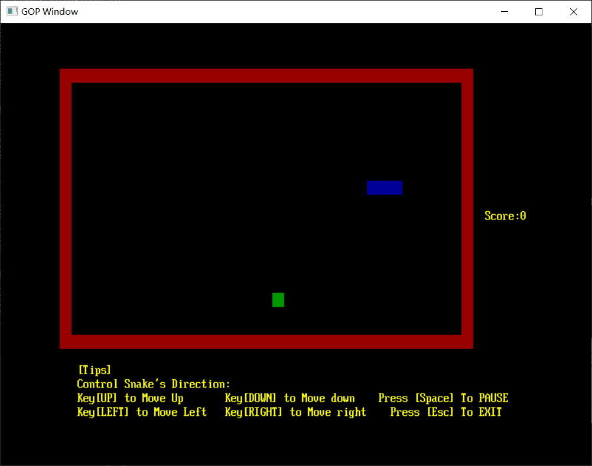
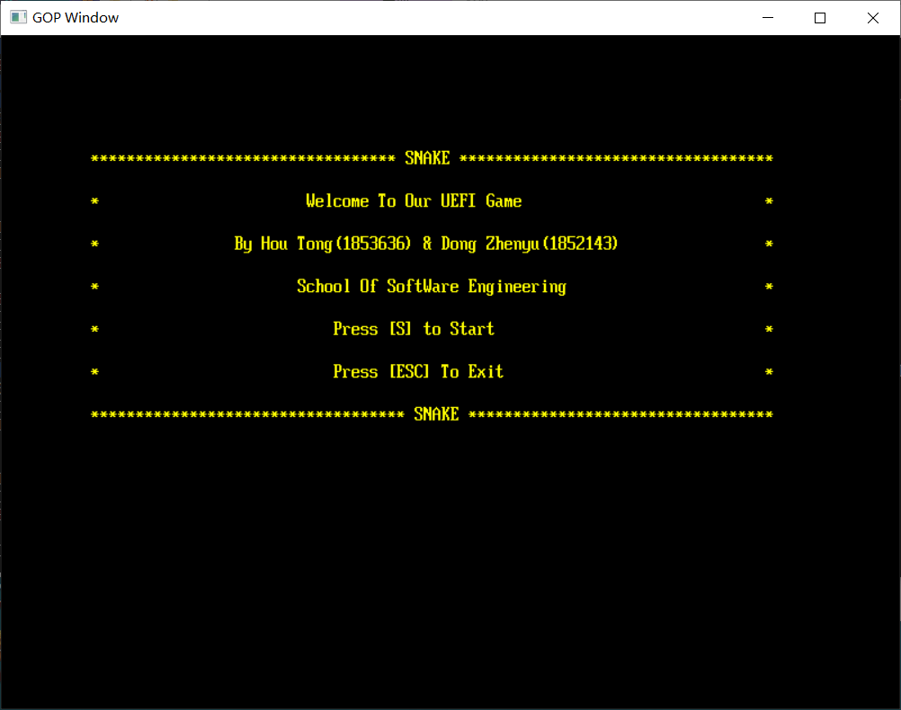
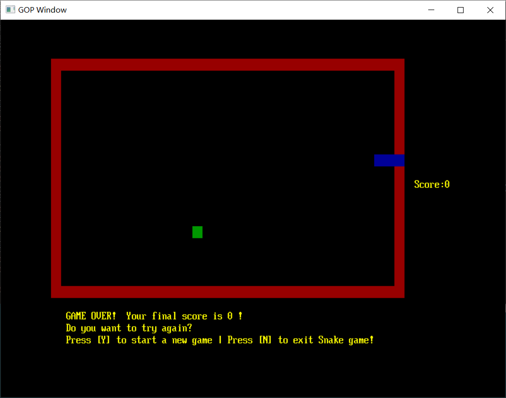

# UEFI贪吃蛇项目开发文档

## 1 项目概述

### 1.1 项目简介

该项目是同济大学软件学院2020年Firmware固件设计的课程设计项目。

本项目是一个在Uefi环境中可运行的贪吃蛇小游戏。游戏的最终目标是通过操作蛇吃到更多的食物，从而得到更高的分数。

### 1.2 项目截图



### 1.3 功能介绍



 

进入游戏界面，按下S键进入游戏，按下ESC键退出游戏。

 



 

进入游戏后，通过方向键上下左右控制贪吃蛇的方向，不断吃食物让贪吃蛇变得更长，但注意不要撞到墙壁或蛇身！在右侧实时显示当前的得分。

在游戏中，可以按空格键暂停和恢复游戏，按ESC键退出游戏。

游戏结束后，可以按下Y键选择再来一次，或按下N键退出游戏。


## 2 组员分工

| **学号** | **姓名** | **分工**                    |
| -------- | -------- | --------------------------- |
| 1853636  | 侯彤     | 底层的数据结构              |
| 1852143  | 董震宇   | 负责GUI界面的展示、事件调度 |


## 3 项目开发流程

### 3.1 先实现底层的数据结构

通过一个二维数组存储盘面信息。(每个位置为蛇、空白、食物、墙之一，通过枚举类型实现) 

```c
typedef enum _BOARDSTATUS{
    snake, food, space,wall
}BOARDSTATUS;
BOARDSTATUS board[height][width];
```

 

一个结构体来存储贪吃蛇每个节点或者食物的坐标信息。

```c
typedef struct _NODE{
    UINT32 x;
    UINT32 y;
}NODE;
```

 

结构体数组来存储整个贪吃蛇的坐标信息。

```c
NODE MySnake[height*width];
```


另一个结构体变量存储食物的位置。

```c
NODE myfood ;
```


### 3.2 贪吃蛇运行的事件处理

带回调函数的EVT_NOTIFY_SIGNAL时间，并设置Timer为0.2秒，直到游戏失败才停止事件。

 

```c
	Status = gBS->CreateEvent(EVT_TIMER | EVT_NOTIFY_SIGNAL, TPL_CALLBACK, (EFI_EVENT_NOTIFY)Run, (VOID*)NULL, &myEvent);
	Status = gBS->SetTimer(myEvent, TimerPeriodic, 2 * 1000 * 1000);
```

 

这样会使得每0.2秒就会调用一次回调函数Run()，贪吃蛇因此每0.2秒就向前移动一格。并在移动完成之后判断是否吃到了食物以及是否触发游戏的失败条件。Run()函数定义如下，实现了游戏的主要过程。

```c
VOID Run(EFI_EVENT Event,VOID *Context)
{
    INT32 headerX, headerY;
    headerX = MySnake[0].x + direction.x;
    headerY = MySnake[0].y + direction.y;
    NODE snakeHeader;
    snakeHeader.x=headerX;
    snakeHeader.y=headerY;
    if(isoverstep(snakeHeader)||isSnake(snakeHeader))
        gameover(Event);
    if(isFood(snakeHeader))
    {
        score ++;
        CreateFood();
    }
    else
    {
        NODE snakeFooter;
        snakeFooter = RemoveSnakeBack();
    }
    PushSnakeFront(snakeHeader);
	showMap();
} 
```


在SetTimer函数的while循环中，会一直读取键盘输入。每当检测到“↑↓←→”之一就会改变蛇头的行进方向(但不能直接反向)，检测到空格键会暂停蛇的移动，检测到ESC键就会直接退出游戏。

```c
 if(!ispaused)
        {
            if(Key.ScanCode == SCAN_UP&&direction.x!=1  )
            {
                direction.x=-1;
                direction.y=0;
            }
            else if(Key.ScanCode == SCAN_RIGHT&&direction.y!=-1   )
            {
                direction.x=0;
                direction.y=1;
            }
            else if(Key.ScanCode == SCAN_DOWN&&direction.x!=-1   )
            {
                direction.x=1;
                direction.y=0;
            }
            else if(Key.ScanCode == SCAN_LEFT&&direction.y!=1   )
            {
                direction.x=0;
                direction.y=-1;
            }
        }
        if(Key.UnicodeChar == ' ')
        {
            if(ispaused)
            {
                Status = gBS->CreateEvent(EVT_TIMER | EVT_NOTIFY_SIGNAL, TPL_CALLBACK, (EFI_EVENT_NOTIFY)Run, (VOID*)NULL, &myEvent);
	            Status = gBS->SetTimer(myEvent, TimerPeriodic, 2 * 1000 * 1000);
                ispaused=0;
            }
            else
            {
                gBS->CloseEvent(myEvent);
                ispaused=1;
            }
        }
```


### 3.3 GUI显示

在GUI中用到的函数及功能：

| **函数原型**                            | **功能**           |
| --------------------------------------- | ------------------ |
| VOID initMap()                          | 初始化盘面         |
| VOID  showMap()                         | 打印盘面           |
| VOID  showTips()                        | 输出提示信息       |
| VOID  welcomeUI()                       | 进入游戏的欢迎界面 |
| VOID  gameOverUI()                      | 游戏结束的界面     |
| VOID  cleanUI()                         | 清屏或清除部分显示 |
| VOID  mySetCursorPos(UINT32 x,UINT32 y) | 设置光标位置       |

根据上面两点的底层实现，依据盘面信息(MySnake数组)来打印出界面，每次执行到Run()函数的末尾就调用showMap()函数重新打印整个盘面，以及更新当前的得分。

```c
VOID showMap() {
	UINT32 i = 0;
	UINT32 j = 0;
	for ( i = 0; i < height; i++) 
	{
		for ( j = 0; j < width; j++) 
		{
			mySetCursorPos(j*2,i);
			if (board[i][j] == wall) 
			{
				gST->ConOut->SetAttribute(gST->ConOut, EFI_TEXT_ATTR(EFI_LIGHTGRAY, EFI_RED));
				gST->ConOut->OutputString(gST->ConOut, L"  ");
			}
			else if (board[i][j] == snake) 
			{
				gST->ConOut->SetAttribute(gST->ConOut, EFI_TEXT_ATTR(EFI_LIGHTGRAY, EFI_BLUE));
				gST->ConOut->OutputString(gST->ConOut, L"  ");
			}
			else if (board[i][j] == food) 
			{
				gST->ConOut->SetAttribute(gST->ConOut, EFI_TEXT_ATTR(EFI_LIGHTGRAY, EFI_GREEN));
				gST->ConOut->OutputString(gST->ConOut, L"  ");
			}
			else 
			{
				gST->ConOut->SetAttribute(gST->ConOut, EFI_TEXT_ATTR(EFI_LIGHTGRAY, EFI_BLACK));
				gST->ConOut->OutputString(gST->ConOut, L"  ");
			}
			gST->ConOut->SetAttribute(gST->ConOut, EFI_TEXT_ATTR(EFI_LIGHTGRAY, EFI_BLACK));
		}
	}
	mySetCursorPos(width * 2 + 2, height/2);
	gST->ConOut->SetAttribute(gST->ConOut, EFI_BACKGROUND_BLACK | EFI_YELLOW);
	gST->ConOut->OutputString(gST->ConOut, L"Score:");
	Print(L"%d\n", score);
} 
```


在打印中，用到了两个高频函数：对光标的定位函数以及设置输出内容前景色与背景色的函数。

对光标定位函数进行封装如下：

```c
VOID mySetCursorPos(UINT32 x, UINT32 y) {

gST->ConOut->SetCursorPosition(gST->ConOut, x, y);

}
```


```c
gST->ConOut->SetAttribute(gST->ConOut, EFI_BACKGROUND_BLACK | EFI_YELLOW);
```

## 4 开发心得

使用UEFI开发这种小游戏，主要是能灵活运用事件处理，并调用UEFI提供的GUI接口来展示界面。数据结构和算法层面和C语言差不多。

通过编写.bat批处理脚本，避免重复输入命令。

```bash
@echo off

edksetup.bat

build -a X64 -t VS2017 -p EmulatorPkg\EmulatorPkg.dsc -m EmulatorPkg\Snake\MySnake.inf
```

 